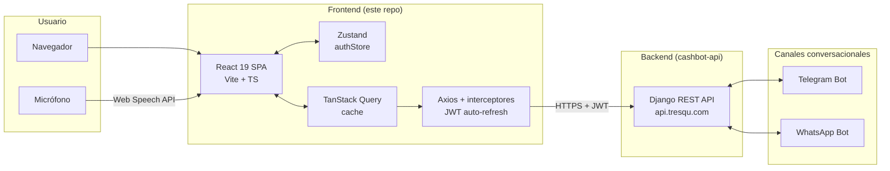
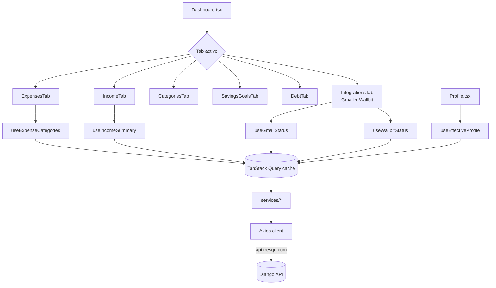
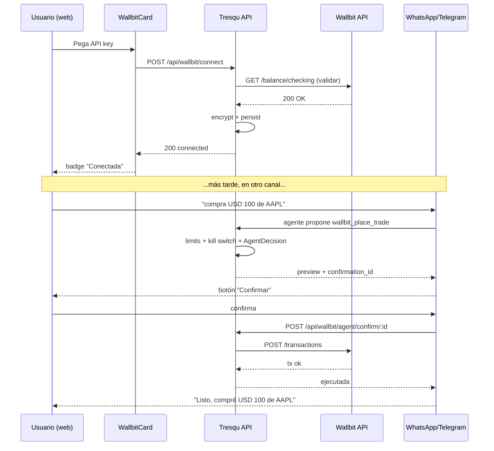

# Tresqu — Asistente Financiero Inteligente

Frontend web de Tresqu: dashboard, chatbot de voz, gestión de transacciones e integraciones (Gmail + **Wallbit**). Construido con React 19 + TypeScript + Vite y desplegado en Cloudflare Pages en [tresqu.com](https://tresqu.com).

---

## Tabla de contenidos

- [¿Qué hace Tresqu?](#qué-hace-tresqu)
- [Arquitectura](#arquitectura)
- [Stack tecnológico](#stack-tecnológico)
- [Setup local paso a paso](#setup-local-paso-a-paso)
- [Features](#features)
  - [Chatbot inteligente](#chatbot-inteligente)
  - [Dashboard analítico](#dashboard-analítico)
  - [Integración Gmail](#integración-gmail)
  - [Integración Wallbit (nuevo)](#integración-wallbit-nuevo)
  - [Perfil de inversión (nuevo)](#perfil-de-inversión-nuevo)
  - [Mercado: gráfico de precios y explorador de activos (nuevo)](#mercado-gráfico-de-precios-y-explorador-de-activos-nuevo)
- [Estructura del proyecto](#estructura-del-proyecto)
- [Scripts disponibles](#scripts-disponibles)

---

## ¿Qué hace Tresqu?

Tresqu es un copiloto financiero conversacional. Desde el dashboard puedes:

- Hablar (literal, con micrófono) o escribirle al chatbot para registrar gastos/ingresos
- Visualizar todo tu dinero en gráficos: torta por categoría, líneas de tendencia, barras apiladas
- Crear categorías personalizadas y metas de ahorro
- Conectar tu **Gmail** para que detecte compras en correos automáticamente
- Conectar tu cuenta de **Wallbit** y operar desde WhatsApp/Telegram con flujo de confirmación
- **(nuevo)** Ver tu **perfil de inversión** combinando tu cuestionario con una inferencia automática de tu contexto financiero

---

## Arquitectura

### Topología



### Flujo de datos del dashboard



### Flujo de conexión + confirmación Wallbit



---

## Stack tecnológico

| Capa | Tecnologías |
|------|-------------|
| Framework | React 19, TypeScript 5.5, Vite 6 |
| Estilos | Tailwind CSS 4, shadcn/ui (Radix UI) |
| Estado servidor | TanStack React Query 5 |
| Estado cliente | Zustand 5 (con persist) |
| HTTP | Axios con interceptores (auto-refresh JWT) |
| Routing | React Router DOM 6 |
| Formularios | React Hook Form + Zod |
| Charts | Chart.js (react-chartjs-2) y Recharts |
| Voz | Web Speech API (STT) + Web Audio API (TTS) |
| Despliegue | Cloudflare Pages — autodeploy en push a `main` |

---

## Setup local paso a paso

### Requisitos

- **Node.js 18+** y npm. Recomendado vía [nvm](https://github.com/nvm-sh/nvm#installing-and-updating)
- Backend Tresqu corriendo en `http://localhost:8000` (ver [`cashbot-api/README.md`](../cashbot-api/README.md))

### 1. Clonar e instalar dependencias

```bash
git clone <repo-url>
cd chat-finance-bot
npm i
```

### 2. Configurar variables de entorno

Crea un `.env` en la raíz del proyecto:

```dotenv
VITE_API_URL=http://localhost:8000
```

> Para producción ya está apuntando a `https://api.tresqu.com` desde la configuración de Cloudflare Pages.

### 3. Arrancar el servidor de desarrollo

```bash
npm run dev
```

Abre [http://localhost:5173](http://localhost:5173). El hot reload está activo.

### 4. Build de producción (opcional, para verificar)

```bash
npm run build
npm run preview
```

---

## Features

### Chatbot inteligente

Disponible como widget flotante en todo el dashboard.

- **Reconocimiento de voz** vía Web Speech API
- **Síntesis de voz** vía Web Audio API
- **Registro natural**: "Gasté $500 en almuerzo" → categoriza y guarda
- **Consultas analíticas**: "¿En qué gasté más este mes?", "¿Cuánto puedo ahorrar?"
- **Comparativas** mes vs mes
- **Sugerencias personalizadas** de reducción de gasto y planes de pago

### Dashboard analítico

- Gráfico de torta por categoría
- Líneas de tendencia mes a mes
- Barras apiladas comparativas
- Balance acumulado
- Filtros por rango de fechas
- Gestión de categorías custom con color e ícono

### Integración Gmail

Desde **Perfil → Conexiones**, "Conectar Gmail" lanza el flujo OAuth de Composio:

1. Backend devuelve un `redirect_url` al Connect Link alojado por Composio (o `already_connected: true` si el lado de Composio ya tiene una conexión activa y solo había que resincronizar el row local).
2. El usuario autoriza en Google → callback en el backend → redirect a `/dashboard/profile?gmail=connected`.
3. La tarjeta muestra estado, correo conectado, contador de correos procesados y de compras detectadas pendientes de categorizar.
4. Si el trigger de Composio queda en `failed`, se expone un botón "Reintentar" que pega a `/retry-trigger/`.

| Archivo | Función |
|---------|---------|
| `src/types/gmail.ts` | Interfaces TypeScript (`GmailConnectionStatus`, `GmailOAuthUrlResponse` con `already_connected`) |
| `src/services/gmail/gmail.ts` | Cliente HTTP a `/api/integrations/gmail/*` (connect-url, status, disconnect, retry-trigger) + listado `/api/gmail/processed-emails/` |
| `src/hooks/useGmailStatus.ts` | Hook TanStack Query con polling para refrescar status mientras el trigger se activa |
| `src/pages/Profile.tsx` | UI principal: maneja el caso `already_connected` invalidando la query sin redirigir |
| `src/components/dashboard/IntegrationsTab.tsx` | Tab del dashboard que renderiza la tarjeta |

### Integración Wallbit (nuevo)

Tresqu se conecta a la cuenta Wallbit del usuario para consultar saldos y transacciones, y para que el agente conversacional pueda **proponer operaciones** (compra/venta, movimientos entre cuentas DEFAULT ↔ INVESTMENT, depósitos/retiros de Robo Advisor, congelar tarjetas).

#### Lo que ya está en la UI

- **`WallbitCard`** (en Integraciones): conectar/desconectar, ver scope, fecha de conexión y último sync.
- **Inputs seguros**: la API key se envía cifrada por HTTPS, **nunca queda en el cliente**.
- **Mensajes de error inline**: 401 / 403 / IP whitelist se muestran claros.

#### Archivos clave

| Archivo | Función |
|---------|---------|
| `src/types/wallbit.ts` | Interfaces TypeScript (status, connect payload) |
| `src/services/wallbit/wallbit.ts` | Llamadas a `/api/wallbit/*` |
| `src/hooks/useWallbitStatus.ts` | Hooks Query (status, connect, disconnect) |
| `src/components/dashboard/WallbitCard.tsx` | Card de conexión en Integraciones |

#### Flujo de confirmación (donde ocurre)

El usuario interactúa con el agente Wallbit principalmente por **WhatsApp y Telegram**. Cuando propone una operación con dinero, el backend persiste una `AgentDecision(requires_confirmation=True)` y manda al canal un preview con botón "Confirmar". El frontend web hoy es el panel de control (conectar, ver estado); el panel de **límites** y el **historial de decisiones** quedan como follow-up de UI (los endpoints ya existen: `/api/wallbit/limits/` y `/api/wallbit/agent/decisions/`).

#### Seguridad — por qué importa

- La API key se valida contra Wallbit antes de persistirla; si no es válida, no se guarda
- Se cifra con Fernet en el backend antes de tocar disco
- Tresqu **nunca** te la muestra de vuelta — para reemplazarla, pegás una nueva
- Desconectar activa un **kill switch** que bloquea cualquier operación durante 365 días
- Hay **límites por usuario** (monto por trade, tope diario, allow/block lists, umbral two-step) configurables vía API

### Perfil de inversión (nuevo)

Antes de que el agente de Wallbit opere dinero real, Tresqu necesita saber
**qué tan agresivo puede ser el usuario sin lastimarse**. El backend
combina un cuestionario (respondido por WhatsApp/Telegram) con una
inferencia automática del contexto financiero. El frontend lo expone en
`/profile` a través del **`RiskProfileCard`**.

#### Qué se ve en la card

- **Score 0-100** con `HoverCard` que muestra los rangos (Conservador 0-35 / Moderado 36-65 / Agresivo 66-100)
- **Badge de la fuente** del resultado: `declarado` · `inferido` · `confirmado por contexto` (agreement) · `ajustado por seguridad` (safety_cap) · `sin evaluar`
- **Banner condicional** con warning cuando hay discrepancia entre lo declarado y el contexto
- **Radar de 5 dimensiones** (Recharts): capacidad de ahorro, previsibilidad de ingresos y gastos (downside-only), apetito inversor en holdings actuales, y reserva acumulada
- **Collapsible "¿Cómo se calculó tu perfil?"** con comparación inferido vs declarado, desglose por dimensión con interpretación textual y resumen del cálculo
- **Botón Reevaluar** que dispara `?refresh=1` para saltarse el cache de 7 días del backend

#### Cómo se rellena el perfil declarado

El usuario lo responde **por WhatsApp o Telegram** diciéndole al bot algo
como *"quiero evaluar mi perfil de inversión"*. Hoy **no hay** un chat
web del cuestionario — el supervisor del chatbot conversacional vive en
los canales de mensajería. Desde el dashboard sí se puede **editar
manualmente** (eso prende `user_override=true`, que el backend respeta
sobre la inferencia).

#### Archivos clave

| Archivo | Función |
|---------|---------|
| `src/types/riskProfile.ts` | Interfaces TypeScript (`EffectiveProfile`, `RiskTolerance`, `RiskSource`, `RiskDimensions`) |
| `src/services/riskProfile/riskProfile.ts` | Llamadas a `/api/agents/risk-profile/effective/` |
| `src/hooks/useRiskProfile.ts` | `useEffectiveProfile` (Query) + `useRefreshEffectiveProfile` (Mutation) |
| `src/components/dashboard/RiskProfileCard.tsx` | Card completa con radar, explicaciones y collapsible |

#### Por qué importa

El score y la tolerancia no son cosméticos. La sub-fase siguiente (1.5)
los va a consumir desde `agent_safety.evaluate_decision()`: cuando el
agente proponga una operación que choque con el perfil efectivo
(ej. perfil conservador + compra de stock muy volátil), el flujo de
confirmación va a mostrar un warning extra y exigir confirmación
adicional. La card es la ventana del usuario a esa lógica.

---

### Mercado: gráfico de precios y explorador de activos (nuevo)

En la pestaña **Inversiones** del dashboard el usuario puede ver la
evolución del precio de cualquier activo y explorar el catálogo de Wallbit.

- **Gráfico de precios por rangos** (`StockPriceChart`): área (Recharts) con
  selector **1D · 1S · 1M · 3M · 1A · 5A · Máx**, precio actual, cambio %
  coloreado y máx/mín. Se abre en un modal al hacer clic en una posición
  (`HoldingDetailModal`) o en un activo del catálogo (`AssetDetailModal`).
- **Explorar activos** (`AssetExplorer`): tabla con **tabs de categoría**
  (Populares por defecto) y buscador. Lista cualquier acción/ETF **invertible
  en Wallbit** (símbolo, nombre, precio, sector); el precio en el tiempo se
  carga **bajo demanda** al abrir el detalle.

La serie histórica la sirve el backend (`/api/market/assets/{symbol}/history/`,
proveedor Twelve Data) porque Wallbit no expone histórico. El listado/catálogo
sale de Wallbit (`/api/wallbit/assets/search/`) y **no** consume cuota de datos
de mercado.

#### Archivos clave

| Archivo | Función |
|---------|---------|
| `src/types/wallbit.ts` | Tipos `PriceRange`, `PricePoint`, `PriceSummary`, `PriceHistoryResponse`, `AssetSearchResult` |
| `src/services/wallbit/marketData.ts` | `getPriceHistory(symbol, range)` |
| `src/services/wallbit/assets.ts` | `assetsService.search(q, category, limit)` |
| `src/hooks/useMarketData.ts` · `useAssetSearch.ts` | Hooks TanStack Query |
| `src/components/dashboard/investments/StockPriceChart.tsx` | Gráfico por rangos |
| `src/components/dashboard/investments/AssetExplorer.tsx` | Tabla con tabs + búsqueda |
| `src/components/dashboard/investments/{Holding,Asset}DetailModal.tsx` | Modales de detalle |

---

## Estructura del proyecto

```
src/
├── App.tsx                       # Rutas con react-router-dom
├── main.tsx                      # Entrypoint + QueryClientProvider
├── pages/
│   ├── Index.tsx                 # Landing
│   ├── Dashboard.tsx             # Dashboard con tabs
│   ├── Login.tsx
│   └── Profile.tsx               # Perfil + conexiones
├── layouts/                      # Wrappers de página
├── components/
│   ├── chatbot/                  # Widget de chat con voz
│   │   ├── useChatBot.tsx
│   │   ├── useSpeechRecognition.tsx
│   │   ├── useTextToSpeech.tsx
│   │   ├── ChatBody.tsx
│   │   ├── ChatHeader.tsx
│   │   ├── ChatInput.tsx
│   │   └── ChatMessage.tsx
│   ├── dashboard/
│   │   ├── ExpensesTab.tsx
│   │   ├── IncomeTab.tsx
│   │   ├── CategoriesTab.tsx
│   │   ├── SavingsGoalsTab.tsx
│   │   ├── DebtTab.tsx
│   │   ├── IntegrationsTab.tsx   # Gmail + Wallbit
│   │   ├── WallbitCard.tsx
│   │   ├── RiskProfileCard.tsx   # ← nuevo (perfil de inversión)
│   │   ├── DashboardSummary.tsx
│   │   ├── DashboardSidebar.tsx
│   │   ├── CumulativeBalanceChart.tsx
│   │   ├── charts/
│   │   ├── data/
│   │   └── dateRangePicker/
│   └── ui/                       # shadcn/ui primitives
├── services/
│   ├── api.ts                    # Axios + interceptores JWT
│   ├── authService.ts
│   ├── expenses/
│   ├── incomes/
│   ├── categories/
│   ├── currencies/
│   ├── gmail/
│   ├── users/
│   ├── wallbit/
│   ├── riskProfile/              # ← nuevo (riskProfile.ts)
│   └── whatsappAuthService.ts
├── hooks/
│   ├── useExpenseCategories.ts
│   ├── useIncomeSummary.ts
│   ├── useGmailStatus.ts
│   ├── useWallbitStatus.ts
│   ├── useRiskProfile.ts         # ← nuevo
│   ├── useStatsIncome.ts
│   ├── useCumulativeBalance.ts
│   └── ...
├── store/                        # Zustand stores
├── types/
│   ├── categories.ts
│   ├── gmail.ts
│   ├── wallbit.ts
│   └── riskProfile.ts            # ← nuevo
├── utils/                        # date helpers, color utils
└── lib/                          # shadcn utils
```

---

## Scripts disponibles

```bash
npm run dev          # Dev server con HMR (http://localhost:5173)
npm run build        # Build de producción → dist/
npm run build:dev    # Build sin minificar (debug en prod)
npm run lint         # ESLint
npm run preview      # Sirve el build de dist/ para inspección
```

---

## Próximas características

- Panel web para gestionar **`AgentLimits`** (montos, allow/block lists)
- Historial completo de **`AgentDecision`** con filtros
- Vista de **`WallbitTxMirror`** con búsqueda semántica (RAG)
- Botones inline de confirmación en el chat web (hoy viven en WhatsApp/Telegram)
- **Chat web del `RiskProfilerGraph`** — hoy el cuestionario solo corre por WhatsApp/Telegram
- **Editor manual del perfil** en el dashboard (slider de tolerancia + `user_override`)
- Predicción de gastos futuros con ML
- Notificaciones push inteligentes

---

## Licencia

Proyecto privado — Tresqu, alianza estratégica Cent × Tresqu.
