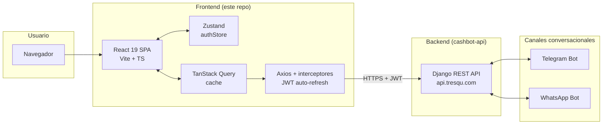
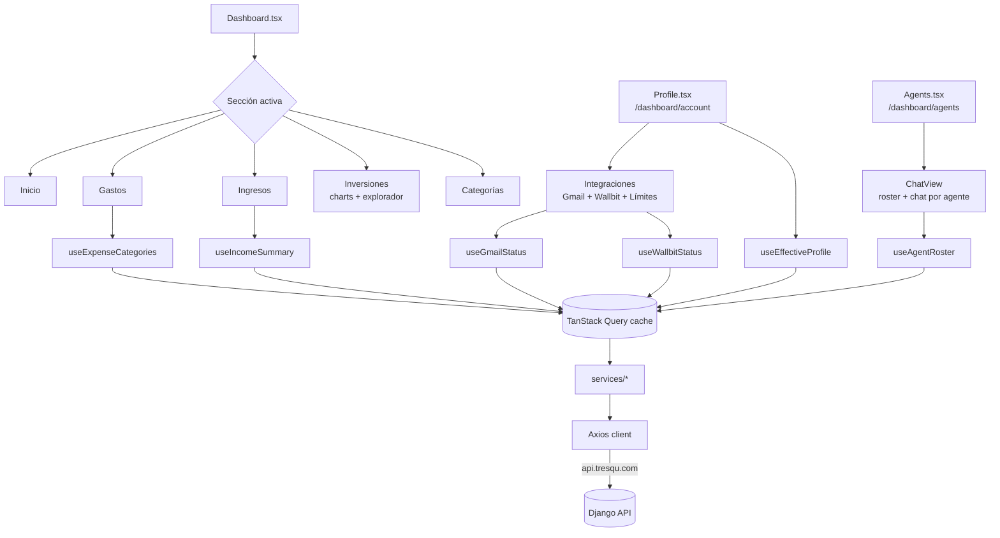
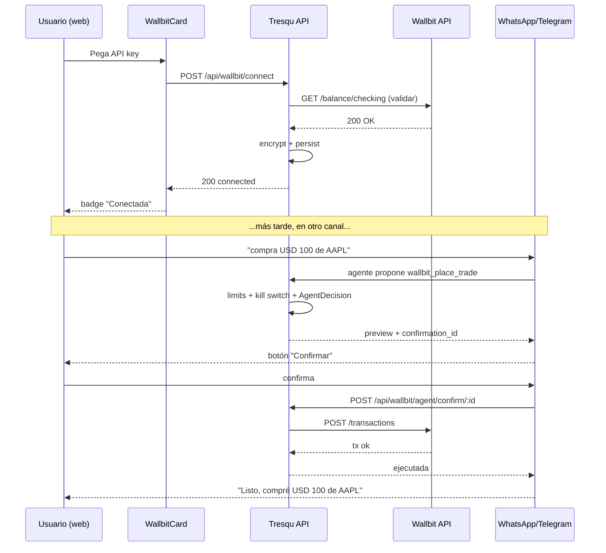

# Tresqu — Asistente Financiero Inteligente

Frontend web de Tresqu: landing, dashboard financiero, **chat web con el equipo de agentes**, gestión de transacciones e integraciones (Gmail + **Wallbit**). Construido con React 19 + TypeScript + Vite y desplegado en Cloudflare Pages en [tresqu.com](https://tresqu.com).

---

## Tabla de contenidos

- [¿Qué hace Tresqu?](#qué-hace-tresqu)
- [Arquitectura](#arquitectura)
- [Stack tecnológico](#stack-tecnológico)
- [Setup local paso a paso](#setup-local-paso-a-paso)
- [Features](#features)
  - [Equipo de agentes (chat web)](#equipo-de-agentes-chat-web)
  - [Dashboard analítico](#dashboard-analítico)
  - [Integración Gmail](#integración-gmail)
  - [Integración Wallbit (nuevo)](#integración-wallbit-nuevo)
  - [Perfil de inversión (nuevo)](#perfil-de-inversión-nuevo)
  - [Mercado: gráfico de precios y explorador de activos (nuevo)](#mercado-gráfico-de-precios-y-explorador-de-activos-nuevo)
- [Estructura del proyecto](#estructura-del-proyecto)
- [Scripts disponibles](#scripts-disponibles)

---

## ¿Qué hace Tresqu?

Tresqu es un copiloto financiero conversacional. Desde el dashboard puedes:

- Chatear con el **equipo de agentes** (un agente por especialidad) para registrar gastos/ingresos, consultar tu dinero y operar en Wallbit — con **tarjetas de confirmación inline** para las acciones con dinero real
- Visualizar todo tu dinero en gráficos: torta por categoría, líneas de tendencia, barras apiladas
- Crear categorías personalizadas con su color, y exportar tus tablas a Excel
- Conectar tu **Gmail** para que detecte compras en correos automáticamente
- Conectar tu cuenta de **Wallbit**, configurar **límites del agente** y confirmar operaciones tanto en el chat web como en WhatsApp/Telegram
- Ver tu **perfil de inversión** combinando tu cuestionario con una inferencia automática de tu contexto financiero

Además, la página pública [tresqu.com/funciones](https://tresqu.com/funciones) (`src/pages/Features.tsx`) es la **guía exhaustiva de todas las funciones** — se mantiene al día con cada feature nueva.

---

## Arquitectura

### Topología



### Flujo de datos del dashboard



### Flujo de conexión + confirmación Wallbit



---

## Stack tecnológico

| Capa | Tecnologías |
|------|-------------|
| Framework | React 19, TypeScript 5.9, Vite 6 |
| Estilos | Tailwind CSS 4, shadcn/ui (Radix UI) |
| Estado servidor | TanStack React Query 5 |
| Estado cliente | Zustand 5 (con persist) |
| HTTP | Axios con interceptores (auto-refresh JWT) |
| Routing | React Router DOM 6 |
| Charts | Recharts |
| Exportación | xlsx (SheetJS) — tablas a Excel |
| UI auxiliar | lucide-react (iconos), sonner (toasts), date-fns + react-datepicker (fechas), react-markdown (chat) |
| Chat de agentes | Respuestas en streaming (`services/agents/chatStream.ts`) |
| Despliegue | Cloudflare Pages — autodeploy en push a `main` |

---

## Setup local paso a paso

### Requisitos

- **Node.js 18+** y npm. Recomendado vía [nvm](https://github.com/nvm-sh/nvm#installing-and-updating)
- Backend Tresqu corriendo en `http://localhost:8000` (ver [`cashbot-api/README.md`](../cashbot-api/README.md))

### 1. Clonar e instalar dependencias

```bash
git clone <repo-url>
cd chat-finance-bot
npm i
```

### 2. Configurar variables de entorno

Crea un `.env` en la raíz del proyecto (hay un `.env.example` de referencia):

```dotenv
VITE_API_BASE_URL=http://localhost:8000
VITE_INSTANCE_NAME=default
```

> Para producción ya está apuntando a `https://api.tresqu.com` desde la configuración de Cloudflare Pages.

### 3. Arrancar el servidor de desarrollo

```bash
npm run dev
```

Abre [http://localhost:5173](http://localhost:5173). El hot reload está activo.

### 4. Build de producción (opcional, para verificar)

```bash
npm run build
npm run preview
```

---

## Features

### Equipo de agentes (chat web)

La sección **Agentes** (`/dashboard/agents`) expone el sistema multi-agente del backend como chat web: un **roster** con cada especialista y una ruta de chat por agente (`/dashboard/agents/:agentId`). `ChatView` decide qué mostrar según la URL.

- **Un agente por especialidad** (gastos e ingresos, Wallbit, analista de mercado, perfil de riesgo) coordinados por el supervisor Tresqu
- **Registro y consultas en lenguaje natural**: "Gasté $500 en almuerzo", "¿En qué gasté más este mes?"
- **Respuestas en streaming** (`services/agents/chatStream.ts`)
- **Confirmación inline**: cuando un agente propone una operación con dinero real, el chat renderiza una **`ConfirmationCard`** con botones Confirmar / Cancelar — ya no hace falta salir a WhatsApp/Telegram
- **Diagrama y traza del equipo** (`AgentTeamDiagram`, `AgentTrace`): se ve cómo Tresqu enruta a cada especialista
- **`ContextChatDock`**: dock de chat contextual disponible dentro del dashboard

> El chat web es **efímero** (vive en memoria de la sesión); la persistencia de hilos quedó como follow-up. El cuestionario guiado de perfil de riesgo sigue corriendo solo por WhatsApp/Telegram.

| Archivo | Función |
|---------|---------|
| `src/pages/Agents.tsx` | Página de la sección, sirve roster y chat por agente |
| `src/components/chatbot/ChatView.tsx` | Conmuta entre roster y chat según la URL |
| `src/components/chatbot/AgentRoster.tsx` | Lista de agentes del equipo |
| `src/components/chatbot/{AgentChat,AgentChatPanel,ChatBody,ChatInput,ChatMessage}.tsx` | Chat y mensajes |
| `src/components/chatbot/ConfirmationCard.tsx` | Tarjeta de confirmación de operaciones con dinero |
| `src/components/chatbot/{AgentTeamDiagram,AgentGraph,AgentTrace}.tsx` | Visualización de la orquestación |
| `src/services/agents/{chatStream,roster}.ts` · `src/hooks/useAgentRoster.ts` | Streaming + roster |

### Dashboard analítico

- Gráfico de torta por categoría
- Líneas de tendencia mes a mes
- Barras apiladas comparativas
- Balance acumulado
- Filtros por rango de fechas
- Gestión de categorías custom con color e ícono

### Integración Gmail

Desde **Perfil → Conexiones**, "Conectar Gmail" lanza el flujo OAuth de Composio:

1. Backend devuelve un `redirect_url` al Connect Link alojado por Composio (o `already_connected: true` si el lado de Composio ya tiene una conexión activa y solo había que resincronizar el row local).
2. El usuario autoriza en Google → callback en el backend → redirect a `/dashboard/account?gmail=connected`.
3. La tarjeta muestra estado, correo conectado y los contadores de **gastos e ingresos detectados** (solo cuentan los registros que siguen existiendo: si el usuario borra el gasto, deja de contar).
4. Si el trigger de Composio queda en `failed`, se expone un botón "Reintentar" que pega a `/retry-trigger/`.

| Archivo | Función |
|---------|---------|
| `src/types/gmail.ts` | Interfaces TypeScript (`GmailConnectionStatus`, `GmailOAuthUrlResponse` con `already_connected`) |
| `src/services/gmail/gmail.ts` | Cliente HTTP a `/api/integrations/gmail/*` (connect-url, status, disconnect, retry-trigger) + listado `/api/gmail/processed-emails/` |
| `src/hooks/useGmailStatus.ts` | Hook TanStack Query con polling para refrescar status mientras el trigger se activa |
| `src/pages/Profile.tsx` | UI principal: maneja el caso `already_connected` invalidando la query sin redirigir |
| `src/components/dashboard/IntegrationsTab.tsx` | Tab del dashboard que renderiza la tarjeta |

### Integración Wallbit (nuevo)

Tresqu se conecta a la cuenta Wallbit del usuario para consultar saldos y transacciones, y para que el agente conversacional pueda **proponer operaciones** (compra/venta, movimientos entre cuentas DEFAULT ↔ INVESTMENT, depósitos/retiros de Robo Advisor, congelar tarjetas).

#### Lo que ya está en la UI

- **`WallbitCard`** (en Integraciones): conectar/desconectar, ver scope, fecha de conexión y último sync.
- **`WallbitLimitsCard`** (en Cuenta → Integraciones): configura los **límites del agente** (monto por trade, tope diario, allow/block lists, umbral two-step) vía `useUpdateAgentLimits`.
- **Inputs seguros**: la API key se envía cifrada por HTTPS, **nunca queda en el cliente**.
- **Mensajes de error inline**: 401 / 403 / IP whitelist se muestran claros.

#### Archivos clave

| Archivo | Función |
|---------|---------|
| `src/types/wallbit.ts` | Interfaces TypeScript (status, connect payload) |
| `src/services/wallbit/wallbit.ts` | Llamadas a `/api/wallbit/*` |
| `src/hooks/useWallbitStatus.ts` | Hooks Query (status, connect, disconnect) |
| `src/components/dashboard/WallbitCard.tsx` | Card de conexión en Integraciones |

#### Flujo de confirmación (donde ocurre)

Cuando un agente propone una operación con dinero, el backend persiste una `AgentDecision(requires_confirmation=True)` y devuelve un preview con `confirmation_id`. La confirmación ya ocurre en **dos lugares**: en **WhatsApp/Telegram** (botón "Confirmar") y en el **chat web de Agentes** (la `ConfirmationCard` inline). El panel de **límites del agente** tiene UI propia (`WallbitLimitsCard`, sobre `/api/wallbit/limits/`); el **historial de decisiones** (`/api/wallbit/agent/decisions/`) queda como follow-up de UI.

#### Seguridad — por qué importa

- La API key se valida contra Wallbit antes de persistirla; si no es válida, no se guarda
- Se cifra con Fernet en el backend antes de tocar disco
- Tresqu **nunca** te la muestra de vuelta — para reemplazarla, pegás una nueva
- Desconectar activa un **kill switch** que bloquea cualquier operación durante 365 días
- Hay **límites por usuario** (monto por trade, tope diario, allow/block lists, umbral two-step) configurables vía API

### Perfil de inversión (nuevo)

Antes de que el agente de Wallbit opere dinero real, Tresqu necesita saber
**qué tan agresivo puede ser el usuario sin lastimarse**. El backend
combina un cuestionario (respondido por WhatsApp/Telegram) con una
inferencia automática del contexto financiero. El frontend lo expone en
`/profile` a través del **`RiskProfileCard`**.

#### Qué se ve en la card

- **Score 0-100** con `HoverCard` que muestra los rangos (Conservador 0-35 / Moderado 36-65 / Agresivo 66-100)
- **Badge de la fuente** del resultado: `declarado` · `inferido` · `confirmado por contexto` (agreement) · `ajustado por seguridad` (safety_cap) · `sin evaluar`
- **Banner condicional** con warning cuando hay discrepancia entre lo declarado y el contexto
- **Radar de 5 dimensiones** (Recharts): capacidad de ahorro, previsibilidad de ingresos y gastos (downside-only), apetito inversor en holdings actuales, y reserva acumulada
- **Collapsible "¿Cómo se calculó tu perfil?"** con comparación inferido vs declarado, desglose por dimensión con interpretación textual y resumen del cálculo
- **Botón Reevaluar** que dispara `?refresh=1` para saltarse el cache de 7 días del backend

#### Cómo se rellena el perfil declarado

El usuario lo responde **por WhatsApp o Telegram** diciéndole al bot algo
como *"quiero evaluar mi perfil de inversión"*. Hoy **no hay** un chat
web del cuestionario — corre solo por los canales de mensajería. Desde el
dashboard se puede **Reevaluar** (recomputar la inferencia saltándose el
cache de 7 días); el backend respeta `user_override=true` cuando el perfil
se fija manualmente, pero el **editor manual en la web** todavía es
follow-up.

#### Archivos clave

| Archivo | Función |
|---------|---------|
| `src/types/riskProfile.ts` | Interfaces TypeScript (`EffectiveProfile`, `RiskTolerance`, `RiskSource`, `RiskDimensions`) |
| `src/services/riskProfile/riskProfile.ts` | Llamadas a `/api/agents/risk-profile/effective/` |
| `src/hooks/useRiskProfile.ts` | `useEffectiveProfile` (Query) + `useRefreshEffectiveProfile` (Mutation) |
| `src/components/dashboard/RiskProfileCard.tsx` | Card completa con radar, explicaciones y collapsible |

#### Por qué importa

El score y la tolerancia no son cosméticos: el backend ya los consume en
`wallbit/agent_safety.evaluate_risk_profile_gate`. Cuando el agente propone
una compra que no encaja con el perfil efectivo (ej. perfil conservador +
stock muy volátil), el flujo de confirmación muestra un warning extra y
exige doble confirmación. La card es la ventana del usuario a esa lógica.

---

### Mercado: gráfico de precios y explorador de activos (nuevo)

En la pestaña **Inversiones** del dashboard el usuario puede ver la
evolución del precio de cualquier activo y explorar el catálogo de Wallbit.

- **Gráfico de precios por rangos** (`StockPriceChart`): área (Recharts) con
  selector **1D · 1S · 1M · 3M · 1A · 5A · Máx**, precio actual, cambio %
  coloreado y máx/mín. Se abre en un modal al hacer clic en una posición
  (`HoldingDetailModal`) o en un activo del catálogo (`AssetDetailModal`).
- **Explorar activos** (`AssetExplorer`): tabla con **tabs de categoría**
  (Populares por defecto) y buscador. Lista cualquier acción/ETF **invertible
  en Wallbit** (símbolo, nombre, precio, sector); el precio en el tiempo se
  carga **bajo demanda** al abrir el detalle.

La serie histórica la sirve el backend (`/api/market/assets/{symbol}/history/`,
proveedor Twelve Data) porque Wallbit no expone histórico. El listado/catálogo
sale de Wallbit (`/api/wallbit/assets/search/`) y **no** consume cuota de datos
de mercado.

#### Archivos clave

| Archivo | Función |
|---------|---------|
| `src/types/wallbit.ts` | Tipos `PriceRange`, `PricePoint`, `PriceSummary`, `PriceHistoryResponse`, `AssetSearchResult` |
| `src/services/wallbit/marketData.ts` | `getPriceHistory(symbol, range)` |
| `src/services/wallbit/assets.ts` | `assetsService.search(q, category, limit)` |
| `src/hooks/useMarketData.ts` · `useAssetSearch.ts` | Hooks TanStack Query |
| `src/components/dashboard/investments/StockPriceChart.tsx` | Gráfico por rangos |
| `src/components/dashboard/investments/AssetExplorer.tsx` | Tabla con tabs + búsqueda |
| `src/components/dashboard/investments/{Holding,Asset}DetailModal.tsx` | Modales de detalle |

---

## Internacionalización (ES/EN)

El sitio público es bilingüe: `/` (español, por defecto) y `/en/*` (inglés: `/en`, `/en/features`, `/en/login`). La app privada (dashboard), las páginas legales y el blog son solo en español.

**Arquitectura** (sin librería i18n — diccionarios TypeScript tipados):

- `src/i18n/routes.ts` — tabla central de rutas ES↔EN (`localizedRoutes`). Única fuente de verdad para `<Route>`, links internos, selector de idioma y canonical/hreflang.
- `src/i18n/copy/` — un diccionario `Dict<T> = Record<"es" | "en", T>` por componente/página. Si falta una clave en un idioma, no compila. Reglas de traducción en `src/i18n/copy/README.md`.
- `src/i18n/boot.ts` — detección de idioma en la **primera visita** (`navigator.language`), con exclusión de crawlers (Googlebot vería `/` redirigir a `/en` sin ella) y preferencia persistida en `localStorage["tresqu:locale"]`. Corre en `main.tsx` antes de `root.render`.
- `src/components/Seo.tsx` — title/description/canonical/hreflang por ruta usando el hoisting de `<title>`/`<meta>` de React 19; elimina los tags `data-seo-static` del shell al montar.
- `en.html` — **shell inglés** para crawlers sin JS (meta, JSON-LD y fallback `#root` en inglés). Vite lo emite como `dist/en.html` (segundo entry); Cloudflare lo sirve como pretty URL `/en` y para `/en/*` vía `public/_redirects`. OJO: debe llamarse `en.html`, no `en/index.html` — Pages descarta como bucle infinito los rewrites a `*/index.html`.

**Espejos que mantener en sync al cambiar copy público**: diccionarios de `src/i18n/copy/` ↔ fallbacks `#root` de `index.html` y `en.html` ↔ `public/llms.txt` (sección ES + sección `## English`) ↔ FAQPage del JSON-LD de ambos shells.

**Verificación de routing real**: `vite preview` no lee `_redirects`; usar `npx wrangler pages dev dist` y comprobar `curl -s localhost:8788/en/features | grep '<html lang'` → `en`.

---

## Estructura del proyecto

```
src/
├── App.tsx                       # Rutas con react-router-dom
├── main.tsx                      # Entrypoint + QueryClientProvider
├── pages/
│   ├── Index.tsx                 # Landing (Hero, equipo de agentes, Wallbit, ...)
│   ├── Dashboard.tsx             # Dashboard por secciones (/dashboard/:section)
│   ├── Agents.tsx                # ← nuevo — Equipo de agentes (chat web)
│   ├── Features.tsx              # Guía pública de funciones (/funciones)
│   ├── Login.tsx                 # Login en dos pasos (crear cuenta → ingresar)
│   ├── Profile.tsx               # Cuenta + conexiones (/dashboard/account)
│   └── {PrivacyPolicy,LegalNotice,...}.tsx
├── layouts/                      # Wrappers de página (DashboardLayout)
├── components/
│   ├── chatbot/                  # ← Equipo de agentes (chat web)
│   │   ├── ChatView.tsx          #   conmuta roster ↔ chat por agente
│   │   ├── AgentRoster.tsx
│   │   ├── AgentChat.tsx · AgentChatPanel.tsx
│   │   ├── ChatBody.tsx · ChatInput.tsx · ChatMessage.tsx
│   │   ├── ConfirmationCard.tsx  #   confirmación inline de operaciones
│   │   ├── AgentTeamDiagram.tsx · AgentGraph.tsx · AgentTrace.tsx
│   │   ├── ContextChatDock.tsx · agentIcons.ts
│   │   └── useChatBot.tsx
│   ├── dashboard/
│   │   ├── ExpensesTab.tsx · IncomeTab.tsx · CategoriesTab.tsx
│   │   ├── IntegrationsTab.tsx   # Gmail + Wallbit
│   │   ├── WallbitCard.tsx
│   │   ├── WallbitLimitsCard.tsx # ← nuevo — límites del agente
│   │   ├── RiskProfileCard.tsx   # perfil de inversión (radar + explicación)
│   │   ├── DashboardSummary.tsx · DashboardSidebar.tsx
│   │   ├── CumulativeBalanceChart.tsx
│   │   ├── investments/          # ← nuevo — charts + explorador de activos
│   │   ├── home/ · charts/ · data/ · dateRangePicker/
│   └── ui/                       # shadcn/ui primitives
├── services/
│   ├── api.ts                    # Axios + interceptores JWT
│   ├── authService.ts · whatsappAuthService.ts
│   ├── agents/                   # ← nuevo — chatStream.ts, roster.ts
│   ├── expenses/ · incomes/ · categories/ · currencies/
│   ├── gmail/ · users/ · wallbit/
│   └── riskProfile/              # riskProfile.ts
├── hooks/
│   ├── useExpenseCategories.ts · useIncomeSummary.ts
│   ├── useGmailStatus.ts · useWallbitStatus.ts
│   ├── useAgentRoster.ts         # ← nuevo
│   ├── useAgentLimits.ts         # ← nuevo (límites del agente)
│   ├── useRiskProfile.ts · useMarketData.ts · useAssetSearch.ts
│   └── ...
├── store/                        # Zustand stores (authStore)
├── types/
│   ├── categories.ts · gmail.ts · wallbit.ts
│   └── riskProfile.ts
├── utils/                        # date helpers, color utils
├── styles/                       # CSS adicional
└── lib/                          # shadcn utils, chartColors
```

---

## Scripts disponibles

```bash
npm run dev          # Dev server con HMR (http://localhost:5173)
npm run build        # Build de producción → dist/
npm run build:dev    # Build sin minificar (debug en prod)
npm run lint         # ESLint
npm run preview      # Sirve el build de dist/ para inspección
```

---

## Próximas características

- **Persistencia del chat web** de Agentes (hoy es efímero: vive en memoria de la sesión)
- Historial completo de **`AgentDecision`** con filtros en la UI web
- Vista de **`WallbitTxMirror`** con búsqueda semántica (RAG)
- **Chat web del `RiskProfilerGraph`** — hoy el cuestionario solo corre por WhatsApp/Telegram
- **Editor manual del perfil** en el dashboard (slider de tolerancia + `user_override`)
- Predicción de gastos futuros con ML
- Notificaciones push inteligentes

---

## Licencia

Proyecto privado — Tresqu, alianza estratégica Cent × Tresqu.
